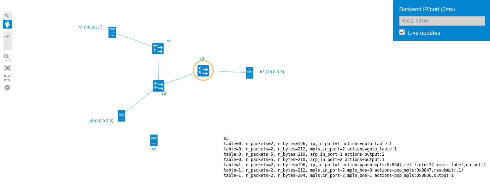

# mntopod
mininet topology daemon : get a live graphical representation of your mininet topologies and flows in your browser in ~30 secondes



## Usage

mntopod includes three components : backend, middleware and client.

The **client** is a webpage that you can host somewhere or just open in your browser (Ctrl-O).

The **middleware** is a single nodejs file that you need to run somewhere reachable from the mininet VM and your client.

```
npm install && npm start
```

The **backend** is a single python file that you include in your mininet topology.

Instanciating `MininetTopologyDaemon` is the only step needed. The IP is the IP of the middleware, and the port number is optional.

**Example :**

```python
#!/usr/bin/python
from mininet.net import Mininet
from mininet.cli import CLI

from mntopobackend import MininetTopologyDaemon

def myNetwork():

    net = Mininet(topo=None, build=False, controller=None)
    s1 = net.addSwitch('s1')
    h1 = net.addHost('h1')
    net.addLink(h1, s1)
    net.start()
   
    mntopod = MininetTopologyDaemon(net, '10.0.2.1', 3141)
    CLI(net)
    mntopod.stop()
    net.stop()

if __name__ == '__main__':
    setLogLevel( 'info' )
    myNetwork()
```


